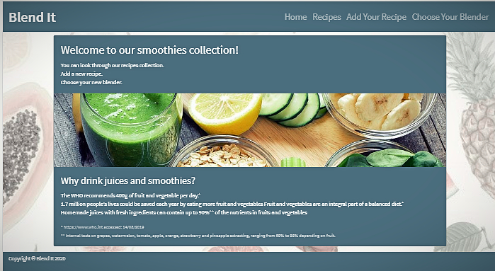
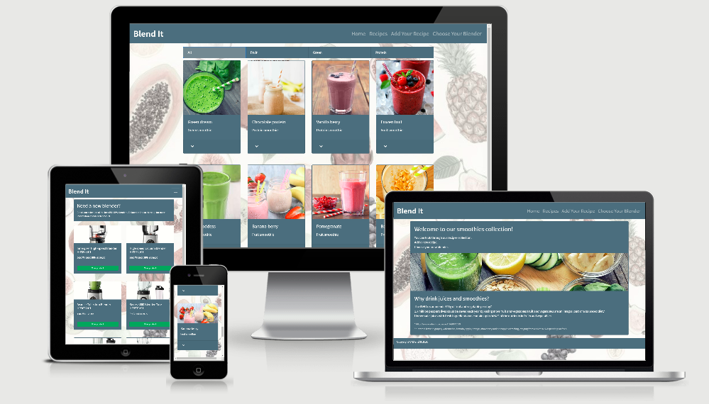

# Data Centric Development Milestone Project

 

   
 

# **BLEND IT**

"Blend It" is a website with a collection of smoothies recipes. It has a choice of recipes in four different categories, the possibility to add, edit, or delete a recipe, intuitive design, and list of recommended blenders.

## [Click To visit "Blend It" !](https://smoothie-cookbook.herokuapp.com/)

---

# **Table of Contents**

## 1. [UX](#ux)

- **[Project Goals](#project-goals)**
- **[User Goals](#user-goals)**
- **[Site owner's goal](#owner-goals)**
- **[Developer Goals](#developer-goals)**
- **[Wireframes](#wireframes)**

## 2. [Features](#features)

- **[Existing Features](#existing-features)**
- **[Features Left To Implement](#features-left-to-implement)**

## 3. [Technologies Used](#technologies-used)

## 4. [Testing](#testing)

## 5. [Deployment](#deployment)

## 6. [Acknowledgments](#acknowledgments)

---

## [UX](#ux)

### [Project Goals](#project-goals)

- To build a full-stack site that allows users to manage a common dataset about a particular domain.
- To build a MongoDB-backed Flask project.
- To build a project with 'CRUD' functionality.
- Deploy the project to Heroku.
- To build a useful, userfriendly, attractive webpage with a collection of healthy recipes.

### [User goals](#user-goals)

- Friendly interface
- Intuitive navigation
- The attractive design which will motivate to try recipes
- Comfortable representation of recipes and access to each
- Ability to choice categories of recipes
- Ability to find, share, store edit, and delete recipes.

"Blend It" met these goals:  
 Based on feedback from users.

- "Home" page giving clear information about the website.
- Easy to navigate through the website. The navigation bar represents a list of pages.
- Easy to open and read information about each recipe. Also possible to open a few recipes at the same time and compare list ingredients or methods.
- Recipes split into three most popular categories of smoothies. Very comfortable and easy to switch between categories.
- The functionality of adding, editing, and deleting recipes has easy access and made in a simple and understandable manner.

### [Site owner's goal](#owner-goals)

- Promote a brand of cooking tools.

  "Blend It" met these goals:

- The website shares a collection of blenders. The collection includes images, specifications, and straight links to the web-shop.

### [Developer Goals](#developer-goals)

- Create a website that allows users to store and easily access cooking recipes.
- Create a representation of each recipe with different fields: recipe image, name of recipe, category, ingredients, instruction, link to the source where the recipe was found.
- Create forms to allow users to add, edit, and delete recipes.
- Provide results in a manner that is visually appealing and user friendly.
- Create a search by a category of recipes.

### [Wireframes](#wireframes)

The wireframes were created using [Balsamiq](https://balsamiq.com/) 
Changes in design and functionality of the website which added in the process: 
  1. Footer 
  2. Pagination 
  3. The idea of each list element of recipe opening separately after been tasted by users was changed.
  In the final version, full recipe information opens in one list element. 
  4. Buttons 'Edit recipe' and 'Delete recipe' added. 
  5. 'Delete recipe' button opening modal window (not shown in wireframes). 
  6. Page 'Choice your Blender' created. List of Blenders. Same cards as for recipe. No accordion element.
     Button which brings the user to the actual webshop.

Web site design 'Home' page [here](https://github.com/AnnaDK/Cook-Book/blob/master/static/images/wireframes/home_page.png) 
Web site design 'Recipes' page [here](https://github.com/AnnaDK/Cook-Book/blob/master/static/images/wireframes/recipes.png) 
Web site design  mobile display [here](https://github.com/AnnaDK/Cook-Book/blob/master/static/images/wireframes/mobile.png) 
Web site design 'Add recipe'[here](https://github.com/AnnaDK/Cook-Book/blob/master/static/images/wireframes/add_recipe.png) 
---

## [Features](#features)

### [Existing Features](#existing-features)

#### **Navigation bar**.

All elements responding on mouse click or finger touch on mobile devices.

- **Blend It**. Website name. Working as a link to the 'Home' page.
  List of website categories:
- **Recipes**. Opening a collection of recipes.
- **Add your recipe**. Opening a form for creating a new recipe.
- **Choose your blender**. Opening a collection of blenders.

#### **Home**.

- Text in paragraph taken from [Philips website](www.philips.co.uk).
  Words : collection, blender, recipe are working as links to the "Blend It" website pages.

#### **Recipes**.

All elements responding on mouse click or finger touch on mobile devices.

- **Categories of recipes**:
  All: displaying a collection of all recipes. 
  Fruit: displaying a collection of "Fruit" smoothies. 
  Green: displaying a collection of "Green" smoothies. 
  Protein: displaying a collection of "Protein" smoothies.

- **Recipe card**:
  All recipe details loading from the MongoDB database. 
  Recipe image: represent a smoothie from the current recipe. 
  Clickable chevron: opening a 'card-body' with recipe details. 

  Name of the recipe. 
  Ingredients: list of ingredients for the current recipe. 
  Category: one of three existing on the website. 
  Instruction. 
  Source: link to the website where the recipe was found. (not required) 
  'Edit' button opens a form where a user can edit a recipe. 
  'Delete' button opens a modal window with a question. If a user gives a positive response, the recipe will be deleted from the website and database. 

- **Pagination**:
  Allowed to navigate between pages of the current category of recipes. 

#### **Add Your Recipe**.

"Add Recipe" form 
Allows user to create own recipe. 
Fields which required:  
      recipe name, category, ingredients, preparation, image link.  
Fields which are not required: 
sourse link. 
Buttons 'Submit' and 'Cancel' 

#### **Edit Recipe**.

Displaying when user click on 'Edit recipe' button in the recipe card. 
Allows editing the existing recipes.
All fields are filled with existing information
Buttons 'Save' and 'Cancel'.

#### **Choose Your Blender**.

Displaying a collection of blenders. 
Each card has an image, blender details and link to the web-shop.

   
 

### [Features Left to Implement](#features-left-to-implement)

- Add an authorization. Create a registration form.
  Make permission  only for registered users: add, edit or delete recipes.
  (Was not in requirements from CI for the current project )

- Create a search by ingredients.
  If collection or recipes will grow the search can help users to find what they need faster.

- Add extra list element in Recipe card called "Recommended blender" Create a feature which will add a link to a recommended for this recipe blender, from an existing database

---

## [Technologies Used](#technologies-used)

This project used HTML, CSS, Python, JS programming languages.

- **[Flask](https://flask.palletsprojects.com/en/1.1.x/)**
  The project uses Flask as web framework
- **[MongoDB](https://mongodb.com/)**  
  The project uses MongoDB as database for this project.
- **[PyMongo](#)**
  PyMongo to make connection between Python and MongoDB.
- **[Balsamiq](https://balsamiq.com/)**  
  The project uses Balsamiqo to build wireframes in the planning stage of development.
- **[GitPod](https://www.gitpod.io/)**  
  The project uses GitPod to build the website.
- **[JQuery](https://jquery.com/)** 
  The project uses JQuery as JS library to make HTML document traversal and manipulative
- **[Bootstrap](https://getbootstrap.com/)** 
  The project uses the Bootstrap framework to help create some elements
- **[FontAwesome](https://fontawesome.com/)** 
  The project uses FonAwesome to use an icons from the library.
- **[Google Fonts](https://fonts.google.com/)** 
  The project uses Google fonts to style the website fonts.
- **[GitHub](https://github.com/)** 
  To store and share all project code remotely.
- **[Google Chrome - Dev Tools]()** 
  The project used Google Chrome Dev Tools to debug code. Check responsiveness.
- **[Favicon generator](https://favicon.io/)** 
  The project uses Favicon generator to create a favicon
- **[Google](https://www.google.com)** 
  Recipes for the project were found by using Google search.
- **[Color Hex Color Codes](https://www.color-hex.com/)** 
  To chooise colors and take a code for the project

---

## [Testing](#testing)

# Automated Testing

### Validation services

Services used to check the validity of the code:

[W3C Markup Validation used to validate HTML.](https://validator.w3.org/) 

[W3C CSS validation used to validate CSS.](https://jigsaw.w3.org/css-validator/) 

---

# Manual testing

Information about all manual testing that has been done
to make sure all areas of the website are working as expected.

Browsers: **Google; Opera; Firefox ; Microsoft Edge.**

Browser width

xs = Extra small <576px

sm = Small ≥576px

md = Medium ≥768px

lg = Large ≥992px

xl = Extra large ≥1200px

|         | XS  | SM  | MD  | LG  | XL  |
| ------- | --- | --- | --- | --- | --- |
| Google  | Ok  | Ok  | Ok  | Ok  | Ok  |
| Firefox | Ok  | Ok  | Ok  | Ok  | Ok  |
| Opera   | Ok  | Ok  | Ok  | Ok  | Ok  |
| ME      | Ok  | Ok  | Ok  | Ok  | Ok  |

In each browser in each size were tested :

Web page :

- Open/Close .
- Switch between navigation bar links.
- Refresh.
- Resize with browser window.
- Responsiveness with dev tools

Design :

- Colors.
- Text
- Fonts
- Images

Layout :

- Bootstrap Grid Layout.

Website functionality:

- Loading of Images
- Loading of Links from database
- Loading of text from the database
- Open a close recipe card.
- The functionality of forms:
  create recipe
  edit recipe
- Delete recipe
- All buttons are working
- A modal window is working

---

# Problems discovered

1.  **Problems with closing the very first recipe card as soon as other opens:**

    - **Problem:**  
      The accordion element in the first recipe closing as soon as the user opens any other recipe.
      It not happening in other cases.
      All other recipes stay open.
      To keep very first open, users have to open it again as soon as other recipes open.

    - **Solution:**  
     No, fail to appear in the dev tool. Couldn't find any solution to solve this bug. 
     
2)  **Categories of recipes flashing white :**

    **Problem**  
    Categories of recipes flashing white, if to fast keep switching between them very fast.

    - **Solution:**  
    
    No special solution found. It happens only if switch to fast. What users did by checking the functionality of the website.

# Real-Time Testing

Asked my friends and family to check the website on their devices.
Go through the collection of recipes, open/close recipe cards. Repeat many times. Press all buttons.
Move through the navigation bar menu back and forward. Resize screen. Use forms to add/edit the recipe. Delete recipe.

**Feed back**.

The website was checked on different mobile devices and desktops.
Everything working apart from problems which were in the description above.

---

## [Deployment](#deployment)

**To run this project  locally**

You need an IDE  
An account at [MongoDB Atlas](https://docs.atlas.mongodb.com/) 
And following must be installed : 
PIP 
Python 3 
Git 

Directions: 
Clone this repository directly into the editor.  
Past this command into the terminal: 
git clone https://github.com/AnnaDK/Cook-Book  
Or click the green button "Clone or download",  
"Download Zip" button,  
Extract the Zip file. 
python3 and pip must be installed  
run $ pip install -r requirements.txt   
Create a database on MongoDB 
In the database create following collections:
* recipes
* categories
* blenders

**recipes:** 
_id: <ObjectId> 
recipe_name:<String> 
category_name:<String> 
ingredients:<String> 
instruction:<String> 
recipe_image:<String> 
source:<String> 

**categories:** 
_id:<ObjectId> 
category_name:<String> 

**blenders:**
_id:<ObjectId> 
blender_image:<String> 
blender_name:<String> 
blender_price:<String> 
shop_link:<String> 
parameters:<String> 

Set the connection to your MongoDB database(MONGO_URI) and a SECRET_KEY with the following syntax: os.environ["SECRET_KEY"] = "YourSecretKey"
os.environ["MONGO_URI"] = "YourMongoURI"

You will now be able to run the application using the following command python3 run.py.

--------------------------------------------------------------------
The website was codded on GitPod.

- Open account on GitHub.
- Create a project repository using the CI full template.
- Use the Gitpod extension to open a working-space.
- Commits were done through Gitpod.

**To deploy the project, the following method was used:** 

Log in on Heroku. 
Create a new app on the Heroku website by clicking the "New" button in your dashboard. 
Give it a name "smoothie-cookbook" and set Europe as region. 
In working space create requirements.txt. and Procfile  
Git add and git commit requirements and Procfile and then git push the project to GitHub. 
In Heroku specify IP and port. 
On the Heroku dashboard click our app, click on "Deploy" followed by "Deployment method" and select GitHub. 
Confirm the linking of the Heroku app to the correct GitHub repository. 
Click on "Settings" "Reveal Config Vars" 
Set config vars: 
DEBUG FALSE  
IP 0.0.0.0  
MONGO_URI mongodb+srv://<username>:<password>@<cluster_name>-qtxun.mongodb.net/<database_name>?retryWrites=true&w=majority 
PORT 8080 
SECRET_KEY <your_secret_key> 
MONGO_URI [documentation](https://docs.atlas.mongodb.com/) 
Click "Deploy" in the Heroku dashboard 
Master branch must be selected in the "Manual Deployment"  
Click "Deploy Branch".

## [Acknowledgments](#acknowledgments)

- Text within this project was written by the developer.
- Text on 'Home' page taken from [Philips webshop](https://www.philips.co.uk/)
- All recipes images as wel as information was taken from different websites. Links provided it the recipes.
- Project idea and design were created by the developer

- The HTML and CSS code was written by the developer
  Code taken from Bootstrap or other sourses - marked by comments.

- Code Institute lessons from " Data-Centric Development" and "Practical Python" modules were used as the main reference in the process of creating this project.

**Special thanks to:**

Code Institute Mentor Spencer Barriball for his help in this project and support. 
Code Institute Tutor support. Special thanks to CI tutor Xavier 
Code Institute Slack Community for the shared experience.

## [Disclaimer](#disclamer)

The "Blend It" project is created for educational purposes only.
